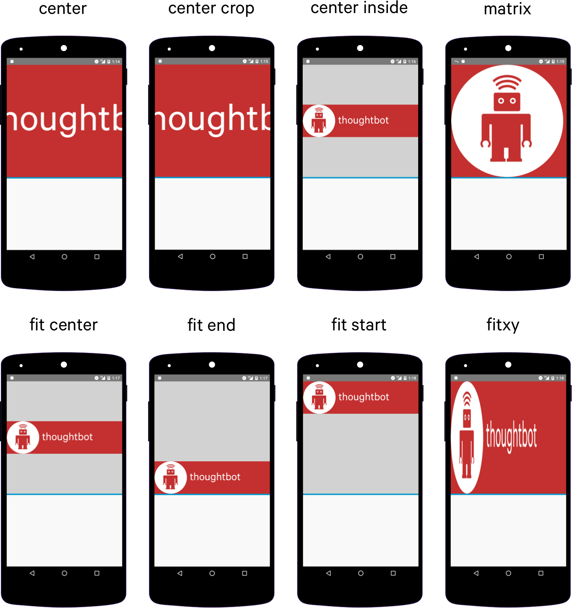

# Android Notes

## Work Manager

1. WorkManager is an Android library that runs deferrable background work when the work’s constraints are satisfied.
2. WorkManager is intended for tasks that require a guarantee that the system will run them even if the app exits.

## Notification

1. Notification Importance is set on notification channel while priority is set on notification, it distinguish by android version supported it.

## Notes about Android Component

1. ContentProvider: Implementation class from android that enables an application to publicly expose its interface to access data storage (sqlite database) for other application to access it. It associates with URI that contains the authorities defined from application that owns the ContentProvider.
2. CursorLoader: We use this in order to create a cursor to load sqlite data at background thread. By using content provider we can create a new instance of CursorLoader that receives specificied “content://“ URI in the constructor.
3. StrictMode class from Android is use to detect undesired work like IO operations on main thread (Thread Policy), it can show warning or even throw exception.
4. By default, calling Handler in main thread is equals to Handler(Looper.getMainLooper())
5. Main difference of services and job schedulers :
   - Service execution controlled by application while job schedulers execution controlled by system
   - Service runs immediately while job schedulers run on criteria defined
   - Job schedulers allow android to provide better management of system resources

## RxJava

1. It is possible to reduce duplicate code of subscribeOn and observeOn boilerplate other than using kotlin extension when performing network IO operations (with MVVM and LiveData). Basically, we don't need to add `observeOn(AndroidSchedulers.mainThread())` on our code because of 'observe' implementation of LiveData will enforce the implementation to run on main thread. So the problem now is where should we reduce the boilerplate of `subscribeOn`. We can solve it by providing RxJavaAdapter in retrofit with a default IO scheduler so every IO operations will automatically run on the schedulers defined. It's not a problem to define a specific schedulers to retrofit because the main function of retrofit itself acts a HTTP client that is performed as IO operations.

```kotlin
.addCallAdapterFactory(RxJava2CallAdapterFactory.createWithScheduler(Schedulers.io()))
```

By this code every threads called upon retrofit callback will subsribe using IO Schedulers as default.

## RecycleView

1. `getAdapterPosition()` returns current position of view holder in the rendered view while `getLayoutPosition()` returns the adapter position of the ViewHolder in the latest layout pass (after rendered).

## Animation

1. AnimatorSet is used to provide multiple animation at the same time or sequentially
2. ViewPropertyAnimator `view.animate()` is used to execute defined animation at the same time only
3. We can create sequence of frame animation by using `<animation-list>` and `<item android:drawable>` xml, set it as background of view then type cast it AnimateDrawable to execute `start()`
4. AnimateVectorDrawable is used to animate vector logo

## Transition

1. In order to apply transition between view in different layout, it's id should be the same
2. Scene object is used to indicate transition between start and ending layout and it needs frame layout's sceneRoot object `Scene.getSceneForLayout()`
3. TransitionManager object is used to execute the transition `TransitionManager.go()`
4. TransitionInflater object is used to inflate transition xml
5. Layout should use ViewGroup's sceneRoot to perform transition between layout

## ConstraintLayout

1. Use ConstraintBaseline to align text (if multiple line, baseline is most top) with other content with text. By using this baseline, the text will always align to the text of other view no matter what changes of the view's height are
2. Setting `layout_width` or `layout_height` to 0dp will cause it to match the measurement of it's height or width to the constraint or by adding `app:layout_constrainedWidth=true`
3. ConstraintBias allows us to modify specific position we desire of a view in a constraint, it can only applied if required constraint are filled (top & bottom) or (start or end)
4. ConstraintChain allows us to equally distribute view in a layout just like flex functions in css
5. Types of chains:
   - Spread: spread spaces around item evenly
   - Packed: organize items together as a packed item
   - Spread Inside: organize item with space between evenly
   - Weighted: organize item by weight provided as scale
6. ConstraintLayout's guideline and barrier (for dynamic view size) to help aligning view component horizontally or vertically

## ImageView

1. ImageView's scaleType visualization



## Important References

1. <https://medium.com/androiddevelopers/exceptions-in-coroutines-ce8da1ec060c>
2. <https://medium.com/androiddevelopers/dagger-code-generation-cheat-sheets-6b4fa2da4e7a>
3. <https://openclassrooms.com/en/courses/4561586-manage-your-data-to-have-a-100-offline-android-app/5770976-expose-your-data-with-a-contentprovider>
4. <https://thoughtbot.com/blog/android-imageview-scaletype-a-visual-guide>
5. <https://www.michaelagreiler.com/code-review-checklist-2>
6. <https://chiuki.github.io/android-shaders-filters/#/>
7. Material Component <https://blog.octo.com/en/android-materialshapedrawable>
